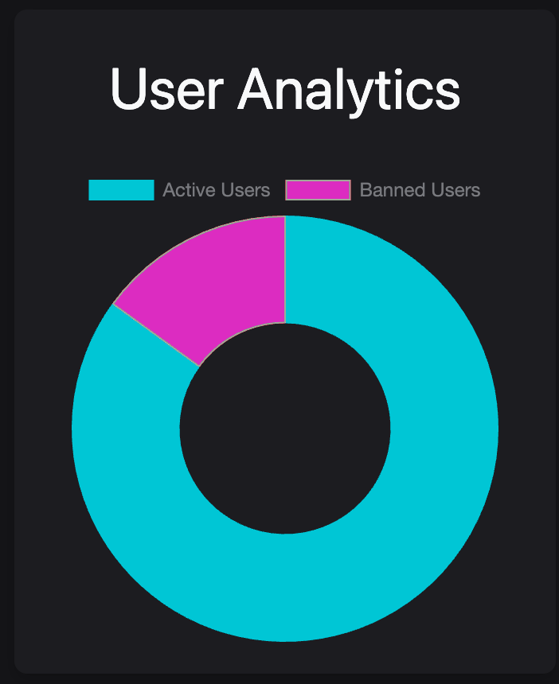

# User test - Admin user analytics
Kleuren spelen een grote rol op onze website, niet alleen voor de dagelijkse gebruikers maar ook voor de admins. Het vinden van de juiste balans is daarom belangrijk: aan de ene kant kleuren die acties duidelijk communiceren, zoals rood voor negatieve gebeurtenissen zoals verbanningen, en anderzijds kleuren die comfort en overzicht bieden voor admins die dagelijks met deze tools werken.

Om deze balans te vinden en te optimaliseren, heb ik een gebruikerstest gedaan op het user analytics sectie van de adminpagina. In dit gedeelte kunnen admins onder andere zien hoeveel gebruikers zijn verbannen, wat meer inzicht geeft op de activiteiten op de forums. Met deze test hoop ik te ontdekken welke kleurencombinaties het beste werken voor zowel duidelijkheid als comfort.

De mensen die ik heb ge-user test hiervoor zijn daarom ook allemaal admins op hun eigen website binnen dit project. 

## De 3 aangeboden opties

### Optie 1:
Rood is duidelijk en vel. Blauw is nog steeds zacht.

### Optie 2:
Zachtere kleuren maar wel duidelijk.

### Optie 3:
Ongebruikelijke kleuren voor de veranderingen en om te experimenteren.

## Uitslagen

### Khaled
De derde optie is wel een beetje raar dus die 100% niet. Wat ik zou willen zien is optie 1 want die is vel en het laat ook zien dat er iets niet goed is. Een ban is niet goed en dat moet ook duidelijk zijn denk ik.
### Alif
Optie 1 is te vel. Ik zou zelf optie 2 kiezen maar zoals je zegt ik weet niet of het wel duidelijk genoeg is. Dus persoonlijk optie 2 maar omdat het een admin pagina is wat andere mensen gebruiken dan optie 1 zodat het duidelijk blijft.
### Daan
Ik vind optie 2 het chilst. Het verschil tussen actieve gebruikers en de verbannen is ook duidelijk omdat die 2 kleuren de zelfde helderheid hebben. De tekst boven dat de kleuren uitlegt maakt het ook duidelijk wat de bedoeling is.
### Youssef
Optie 3 heeft een futuristische vibe dus dan zou ik die kiezen voor een wat modernere website 
### Pascal
Die tweede (optie 2) is iets wat ik ook zelf gebruik op mijn website. Het is duidelijk en niks wat te vel is dus dat biedt comfort aan voor als je het dagelijks gebruikt

## Conclusie
De meeste mensen kiezen voor optie 2, omdat deze een goede balans biedt tussen duidelijke kleuren voor zowel normale als "slechte" acties, terwijl de kleuren tegelijkertijd niet te fel zijn voor het oog. Dit is een belangrijk punt voor de admins, aangezien zij dagelijks met deze omgeving werken. Optie 1 kwam als tweede keuze naar voren, maar de voorkeur ging uiteindelijk uit naar een rustiger kleurenpalet, aangezien felrode tinten minder prettig zijn om dagelijks mee te werken.