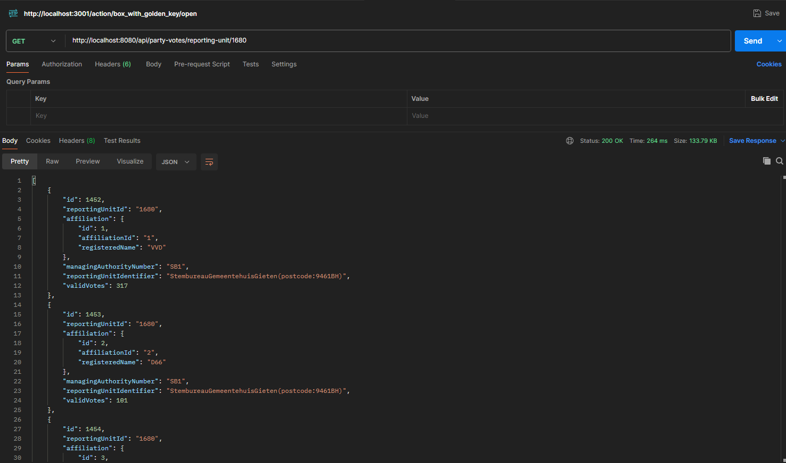

### `PartyVotesController`

**Beschrijving**: Deze controller handelt de verzoeken af die te maken hebben met de stemmen per partij.

**Endpoints**:
- `GET /api/party-votes/reporting-unit/{reportingUnitId}`: Haalt de stemmen per partij op voor een specifiek stembureau.

**Code**:
```java
@RestController
@RequestMapping("/api/party-votes")
public class PartyVotesController {

    @Autowired
    private PartyVotesRepository partyVotesRepository;

    @GetMapping("/reporting-unit/{reportingUnitId}")
    public List<PartyVotes> getPartyVotesByReportingUnit(@PathVariable String reportingUnitId) {
        return partyVotesRepository.findByReportingUnitId(reportingUnitId);
    }
}
```
**test Postman**:


