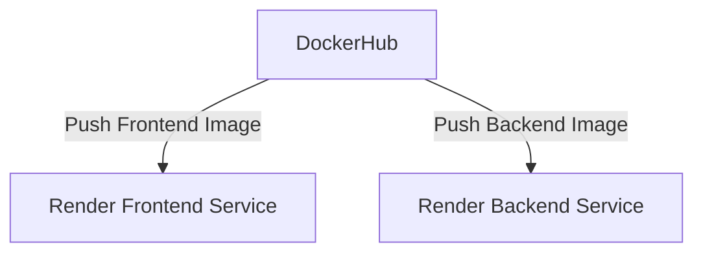
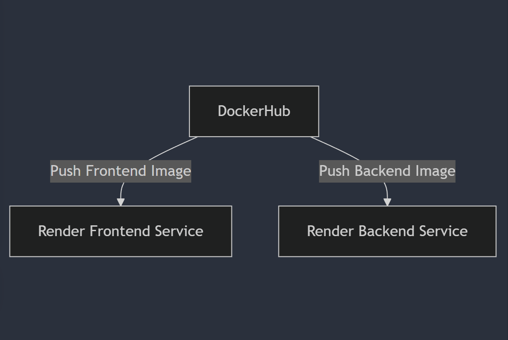

# Deployment and Configuration

## Introduction
This document provides a high-level overview of the application, its purpose, target audience, and key features. It sets the context for the reader and explains what the document covers.

## Overview
This document describes how to deploy the application, including different environments such as staging and production. It includes information on deployment artifacts, configuration parameters, and a deployment diagram.

## Deployment Artifacts
The application is divided into two main components: frontend and backend. Both components are containerized using Docker.

### Frontend
- **Dockerfile**: The Dockerfile for the frontend is used to build the Docker image.
- **Docker Image**: The built Docker image is pushed to DockerHub.

### Backend
- **Dockerfile**: The Dockerfile for the backend is used to build the Docker image.
- **Docker Image**: The built Docker image is pushed to DockerHub.

## Deployment Process
The deployment process involves the following steps:

1. **Build Docker Images**: Build the Docker images for both frontend and backend.
2. **Push to DockerHub**: Push the built Docker images to DockerHub.
3. **Deploy to Render**: Deploy the Docker images from DockerHub to the Render server.

### Step-by-Step Deployment

1. **Build Docker Images**:
   - Navigate to the frontend directory and build the Docker image:
     ```sh
     docker build -t your-dockerhub-username/frontend:latest .
     ```
   - Navigate to the backend directory and build the Docker image:
     ```sh
     docker build -t your-dockerhub-username/backend:latest .
     ```

2. **Push to DockerHub**:
   - Push the frontend Docker image to DockerHub:
     ```sh
     docker push your-dockerhub-username/frontend:latest
     ```
   - Push the backend Docker image to DockerHub:
     ```sh
     docker push your-dockerhub-username/backend:latest
     ```

3. **Deploy to Render**:
   - Log in to Render account.
   - Create a new web service for the frontend and configure it to pull the Docker image from DockerHub.
   - Create a new web service for the backend and configure it to pull the Docker image from DockerHub.

## Configuration Parameters
The application requires several configuration parameters, such as environment variables and database settings.

### Environment Variables
- **FRONTEND_ENV**: The environment for the frontend (e.g., `staging`, `production`).
- **BACKEND_ENV**: The environment for the backend (e.g., `staging`, `production`).
- **DATABASE_URL**: The URL of the database.
- **API_BASE_URL**: The base URL for the API.

### Database Settings
- **DB_HOST**: The hostname of the database server.
- **DB_PORT**: The port number of the database server.
- **DB_USER**: The username for the database.
- **DB_PASSWORD**: The password for the database.
- **DB_NAME**: The name of the database.

## Deployment Diagram
Below is a deployment diagram illustrating the deployment architecture:
Mermaid-code:

