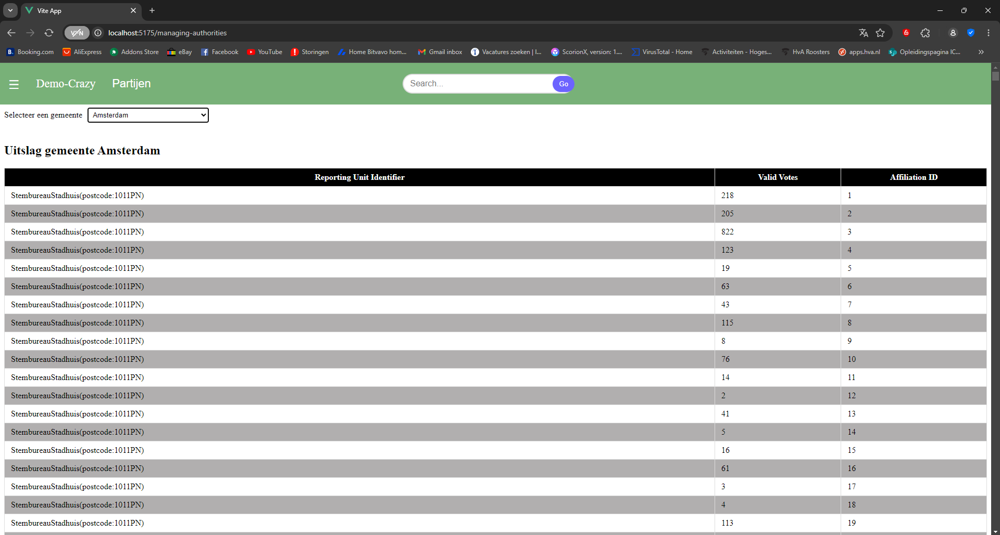
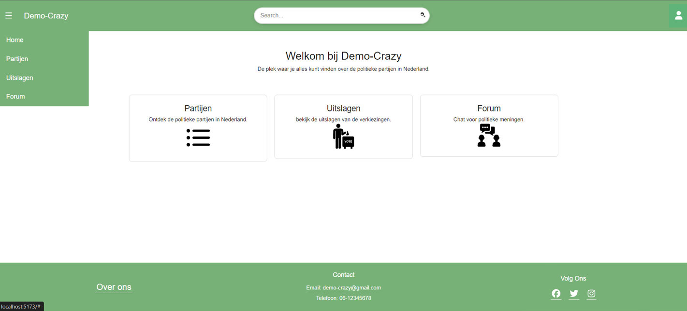
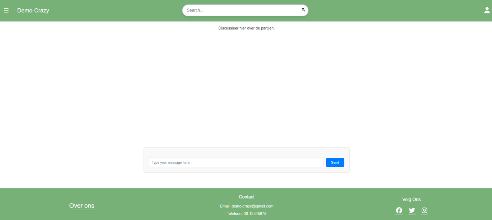

# Project Overzicht
https://gitlab.fdmci.hva.nl/semester-3-hbo-ict/onderwijs/student-projecten/2024-2025/out-p-se-ti/semester-1/wiipuujaamee42/-/issues/?sort=created_date&state=opened&first_page_size=100
## 1. Belangrijkste Userstories 
Planning poker: [planning-poker.md](planning-poker.md)
- #18 -  As a user, I want to see the national voting results so that I can gain insight into the election outcomes and the distribution of votes per party.
- #20 -  As a user, I want to see the election results for each polling station of the local authority
- #8 - As a user, I want the ability to delete my own forum posts, so that I can easily remove messages I no longer wish to send, such as accidental posts or outdated content, ensuring my contributions remain relevant and intentional.

## 2. Doestellingen sprint 3
- Userstories die in deze sprint worden opgepakt.
- Deployment van de applicatie.

## 3. Design
- Figma (https://www.figma.com/design/LixWRtULzqHQRI1q7uIKg4/Untitled?node-id=0-1&node-type=canvas&t=I80ZeDepqD3iYuAo-0)

## 4. Wat staat er al?
- (lokaal) MySQL database met de benodigde tabellen, zoals party_votes, affiliations, candidates, etc.
- front-end die party_votes tabel van de database kan ophalen en weergeven.

## 5. Testen

