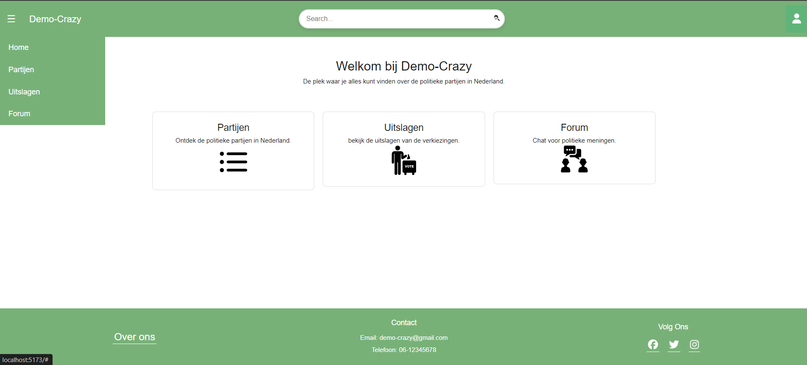
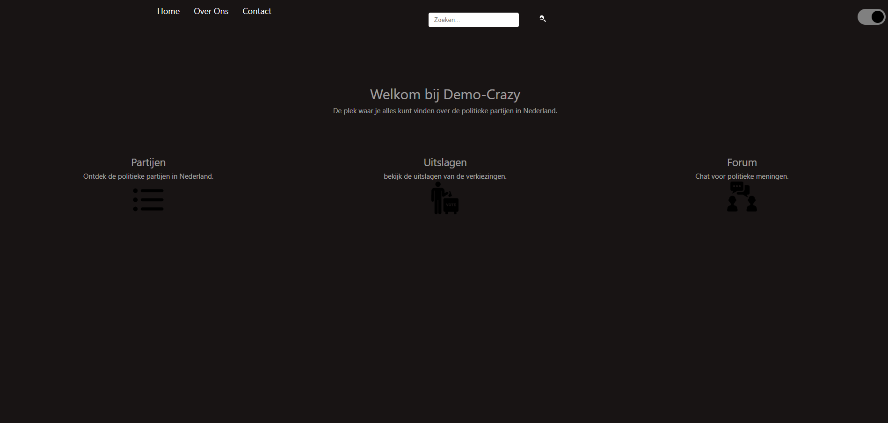

# Project Overzicht
https://gitlab.fdmci.hva.nl/semester-3-hbo-ict/onderwijs/student-projecten/2024-2025/out-p-se-ti/semester-1/wiipuujaamee42/-/boards/29574
# Planning Poker Sprint 4
[planning-poker.md](planning-poker.md)
## 4. Wat is er toegevoegd?
- Uitslagen op gemeentelijk niveau
- Zoek functionaliteit op stembureau
- Totaal aantal stemmen per lid 
- Admin die grafiek van de user kan zien en user verwijderen. 
### Extra User Stories
- News feed
- Dark mode 
## 2. Doestellingen sprint 5
- Jwt token voor login
- Forum
- 
## 3.Rebrand Design

